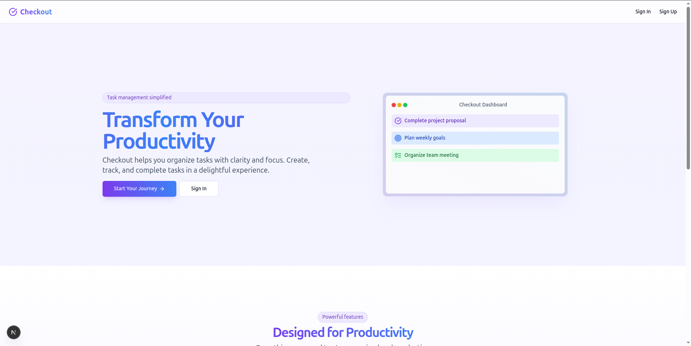
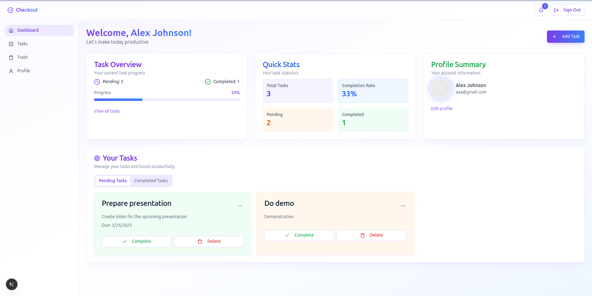
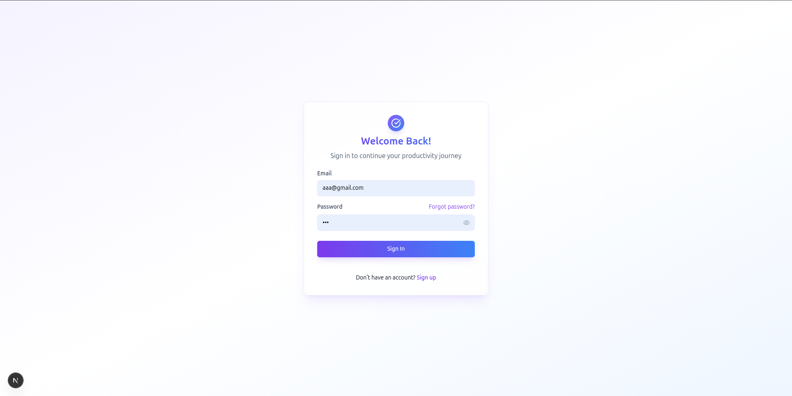

# Checkout

A website that allows users to create and manage their tasks and activities. It is built with Next.js, TypeScript and Tailwind CSS.

## Introduction

Checkout is a productivity app designed to help users create, track, and manage tasks effortlessly. It features:

- 🔐 User authentication (login/signup)
- ✏️ Task creation, editing, and deletion
- ✅ Real-time status updates (pending/completed)
- 📱 Responsive design for all devices

  📖 **Blog Post**: [Blog Post](#)

  🔗 **Deployed link**: [Vercel deployment](http://bit.ly/4cyrqXT)

  👨‍💻 **Author**: [Raymond Aboagye](https://www.linkedin.com/in/aa-raymond)

  **Screenshots**:
  
    
  

### Installation and setup

- Clone the repository
- install dependencies
- Run the development server

  npm install

  npm run dev

  Open http://localhost:3000 in your browser.

#### Usage

    Sign Up/Log in

    Add a task: Click the "+" button, enter details, and save.

    Edit/Delete: Hover over a task to see action buttons.

    Toggle status: Check the "Complete" box to mark as done.

##### Contributing

Fork the project.

Create a branch: git checkout -b feature/your-feature.

Commit changes: git commit -m 'Add some feature'.

Push: git push origin feature/your-feature.

Open a Pull Request and describe your changes.

###### License

MIT © [Pappy](https://github.com/pa-ppy)  
_Free to use, modify, and share..._
